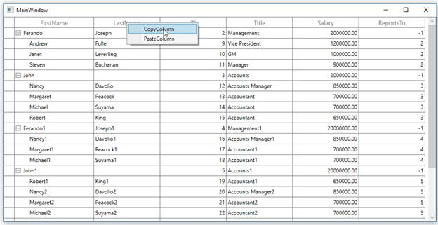

# How to Copy a Column and Paste it as a New Column in WPF TreeGrid?

This sample illustrates how to copy a column and paste it as a new column in [WPF TreeGrid](https://www.syncfusion.com/wpf-controls/treegrid) (SfTreeGrid).

You can copy a column and paste it into a new position using the context menu option in TreeGrid.

### XAML

``` xml
<syncfusion:SfTreeGrid.HeaderContextMenu>
    <ContextMenu ItemsSource="{Binding Menu,Source={StaticResource viewmodel}}" >
        <ContextMenu.ItemContainerStyle>
            <Style TargetType="MenuItem">
                <Setter Property="Command" Value="{Binding MyCommand,Source={StaticResource  viewmodel}}">
                </Setter>
                <Setter Property="CommandParameter" >
                    <Setter.Value>
                        <MultiBinding Converter="{StaticResource ResourceKey=converter}">
                            <Binding RelativeSource="{RelativeSource Self}"/>
                            <Binding />
                        </MultiBinding>
                    </Setter.Value>
                </Setter>
            </Style>
        </ContextMenu.ItemContainerStyle>
    </ContextMenu>
 </syncfusion:SfTreeGrid.HeaderContextMenu>
```

### C#

``` c#
private static void OnCopyColumn(object obj)
{
    if (obj is TreeGridColumnContextMenuInfo)
    {
        // The selected column is stored into CopiedColumn.
        CopiedColumn = (obj as TreeGridColumnContextMenuInfo).Column;
    }
}

private static void OnPasteColumn(object obj)
{
    if (obj is TreeGridColumnContextMenuInfo && CopiedColumn != null)
    {
        var grid = (obj as TreeGridColumnContextMenuInfo).TreeGrid;
        //  Get the index for corresponding column.
        var index = grid.Columns.IndexOf((obj as TreeGridColumnContextMenuInfo).Column);
        // Copy the column and insert based on the index position.
        grid.Columns.Insert(index + 1, new TreeGridTextColumn() { MappingName = CopiedColumn.MappingName });
    }
}
```

### Copy the ID column using context menu



### Paste the ID column after ReportsTo column

